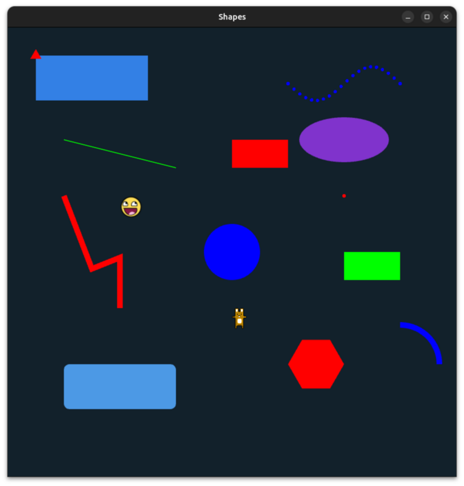

# sky_renderer

**sky_renderer** is a minimalistic 2D graphics engine built in Rust with native bindings to OpenGL. Ultimately, the 
goal is to provide a robust platform for drawing 2D shapes and visualizing data in real-time.

This version provides low-level bindings to OpenGL and is not yet production-ready. Future versions will
add support for additional drawing primitives such as lines, texts and other shapes, as well as a 
higher-level rendering API abstracting OpenGL.

## 🚧 Status

*Because the APIs are evolving, please make sure to always use the latest release*.

As of version 0.2.0 (this release), a higher-level API has been introduced. 
You can now create and render shapes without leveraging the low-level OpenGL APIs. For an example on how to use 
the higher-level APIs, refer to `shapes.rs` in the [examples](https://github.com/algonents/sky-renderer/tree/master/examples) folder:

```
extern crate sky_renderer;

use sky_renderer::core::{App, Renderer, Window};
use sky_renderer::graphics2d::renderable::Renderable;
use sky_renderer::graphics2d::renderable::RenderableShape;
use sky_renderer::graphics2d::shape::Rectangle;

fn main() {
    let window = Window::new("Shapes", 800, 600);
    let mut app = App::new(window);

    let mut shapes = vec![
        RenderableShape::line(100.0, 200.0, 300.0, 250.0, (0.0, 1.0, 0.0)),
        RenderableShape::rectangle(50.0, 50.0, 200.0, 80.0, (0.2, 0.5, 0.9)),
        RenderableShape::rectangle(400.0, 200.0, 100.0, 50.0, (1.0, 0.0, 0.0)),
        RenderableShape::circle(400.0, 400.0, 50.0, (0.0, 0.0, 1.0)),
        RenderableShape::from_shape(600.0, 500.0, Rectangle::new(100.0, 50.0),(0.0, 1.0, 0.0))
    ];

    let renderer = Renderer::new();

    app.on_render(move || {
        for shape in &mut shapes {
            shape.render(&renderer);
        }
    });
    app.run();
}
```


Note that this is still a (very) early release: this version provides a limited set of bindings to OpenGL and is 
not yet suitable for production use. Additional `graphics2d` primitives need to be implemented and the APIs may 
continue to evolve. 

## 📖 Docs

### Wiki

Refer to the **sky_renderer** GitHub [wiki](https://github.com/algonents/sky-renderer/wiki), which will be updated soon.

### 📦 Examples

Refer to the [examples](https://github.com/algonents/sky-renderer/tree/master/examples) provided in the **sky_renderer** GitHub repository. 
The examples will be updated as new features are added.


## 🐞 Issues

You can raise issues directly on [Github](https://github.com/algonents/sky-renderer/issues).

## 🔧 Installation

### Linux

Make sure you have all dependencies installed on your system (including a C/C++ compiler and CMake):

```shell script
sudo apt-get install libgl1-mesa-dev
sudo apt install mesa-utils
sudo apt install libglfw3-dev
```

You can add **sky_renderer** as a dependency to your project. When building your project, cargo will first build (using CMake with your system's C/C++ compiler) a static library containing the **sky_renderer** ffi bindings to OpenGL (the ffi bindings can be found [here](https://github.com/algonents/sky-renderer/tree/master/cpp))


### Windows

Make sure you are using release 0.1.7 or later (there was no Windows support for earlier versions). Ensure you have Visual C/C++ and CMake installed on your system.
Also use [vcpkg](https://learn.microsoft.com/en-us/vcpkg/get_started/overview) to install glfw on your system:

```shell script
git clone https://github.com/microsoft/vcpkg.git
cd vcpkg
.\bootstrap-vcpkg.bat
.\vcpkg install glfw3
```

You must also update your system's environment variables:

- Define the `VCPKG_LIB_PATH` environment variable to point to vcpkg's lib folder (this is where glfw3.lib is installed, for example `D:\GitHub\vcpkg\installed\x64-windows\lib`)

- Update your system's `PATH` environment variable to point to vcpkg's bin folder (this is where glfw3.dll is installed, for example `D:\GitHub\vcpkg\installed\x64-windows\bin`)

### macOS

Ensure you have CMake and a C/C++ compiler installed on your system.
Use [Homebrew](https://brew.sh/) to install glfw on your system:

```shell script
brew install glfw
brew info glfw
```

Once glfw is installed, the crate's build script will look for the glfw libraries under `/opt/homebrew/lib`

